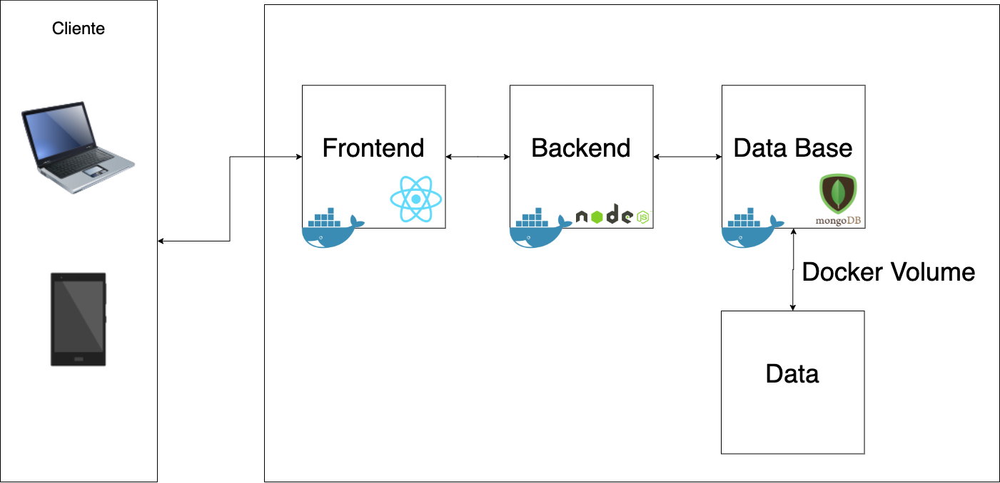

# CLASE 2 SO1 1S 2022
## Descripción
En esta sesión se dio una introducción a docker, una herramienta que permite automatizar el despliegue de aplicaciones dentro de contenedores de software, haciendo uso de virtualización de aplicaciones en múltiples sistemas operativos. Se dio una explicación sobre esta herramienta, como instalar docker en un sistema operativo linux, seguido de los principales comandos que permiten su utilización, por último se desarrollaron ejemplos de cómo crear contenedores con docker y también el uso de volumes de docker para la persistencia de datos.

## Herramientas Utilizadas
- [ Install Docker ](https://docs.docker.com/get-docker/)
- [ Docker Hub ](https://hub.docker.com/)
- [ Docker Volumes ](https://docs.docker.com/storage/volumes/)

## Recursos
- [ Grabación ](https://youtu.be/j_-9HH_2vC8)
- [ Slides ](/Slides)
- [ Código ](/Code)

## Ejemplo
El ejemplo realizado es una aplicacion que registra estudiantes, para esto se cuenta con un frontend desarrollado en React, un servidor desarrollado en NodeJS y como motor de base de datos se utiliza un contenedor de mongoDB.

## Arquitectura 


### Comandos utilizados en el ejemplo
```sh
# Para ver documentacion de docker en consola
docker --help

# Para descargar la imagen de mongo desde el registry
docker pull mongo

# Para crear un container de MongoDB 
docker run -d -p 27017:27017 --name dbmongo \
    -e MONGO_INITDB_ROOT_USERNAME=mongoadmin \
    -e MONGO_INITDB_ROOT_PASSWORD=So1pass1S_2022 \
    mongo

# Para ingresar al container de mongo
docker exec -it dbmongo bash  

# Para crear un container de MongoDB con Volumes:
docker run -d -p 27017:27017 --name dbmongo \
    -v /Users/carlosdavid/Desktop/Clase2/dockerVolumes:/data/db \
    -e MONGO_INITDB_ROOT_USERNAME=mongoadmin \
    -e MONGO_INITDB_ROOT_PASSWORD=So1pass1S_2022 \
    mongo 

# Para instalar nano
apt-get update
apt-get install nano

# Para levantar el backend ingresar a Code/backend
npm install
npm start

# Para levantar el frontend ingresar a Code/frontend
yarn install
yarn start
```

### DOCKER - Comandos 
```sh
# Para descargar la ultima version de una imagen utilizamos:
docker pull <IMAGE>

# Para descarga una version especifica de una imagen utilizamos:
docker pull <IMAGE>:<TAG>

# Para listar las imagenes en nuestro sistema utilizamos:
docker images

# Para crear un nuevo contenedor utilizamos:
docker run <ARGUMENTOS> <IMAGE>:<TAG>

# Para listar los contenedores en ejecucion utilizamos: 
docker ps

# Para listar los contenedores detenidos utilizamos:
docker ps -a

# Para detener uno o mas contenedores utilizamos:
docker stop <CONTAINER_ID|CONTAINER_NAME> 

# Para iniciar uno o mas contenedores detenidos utilizamos:
docker start <CONTAINER_ID|CONTAINER_NAME> 

# Para eliminar uno o mas contenedores detenidos utilizamos:
docker rm <CONTAINER_ID|CONTAINER_NAME> 

# Para eliminar uno o mas contenedores en ejecucion utilizamos:
docker rm <CONTAINER_ID|CONTAINER_NAME> -f

# Para eliminar uno o mas imagenes usando el id y que no tengan contenedores en ejecucion asociados utilizamos:
docker rmi <IMAGE_ID>

# Para eliminar uno o mas imagenes usando el nombre, tag y que no tengan contenedores en ejecucion asociados utilizamos:
docker rmi <IMAGE_NAME>:TAG 

# Para visualizar los logs del contenedor utilizamos:
docker logs <CONTAINER_ID|CONTAINER_NAME>

# Para visualizar los logs en modo de escucha utilizamos:
docker logs --folow <CONTAINER_ID|CONTAINER_NAME>

# Para eliminar todas las imagenes que no estan en uso utilizamos:
docker image prune -fa
```

### DOCKER - Argumentos
```sh
# Para que el contenedor corra en segundo plano y la consola quede libre utilizamos: 
-d

# Para mapear los puertos del host con los del contenedor utilizamos:
-p <HOST_PORT>:<CONTAINER_PORT>

# Para pasarle variables de entorno al contenedor utilizamos:
-e <VARIABLE_NAME>=<VALUE>

# Para asignarle un nombre especifico al contenedor utilizamos:
--name <CONTAINER_NAME>

# Para mapear un volume al contenedor utilizamos:
-v <HOST_PATH>:<CONTAINER_PATH>

# Para tener una terminal interactiva al ingresar al contenedor utilizamos:
-it
```

### DOCKER - Explore Container
```sh
# Para ingresar a un contenedor utilizamos:
docker exec -it <CONTAINER_NAME|ID> bash

# Si no funciona bash porque la imagen que utilizo el contendor era una imagen base ligera utilizamos:
docker exec -it <CONTAINER_NAME|ID> sh
```